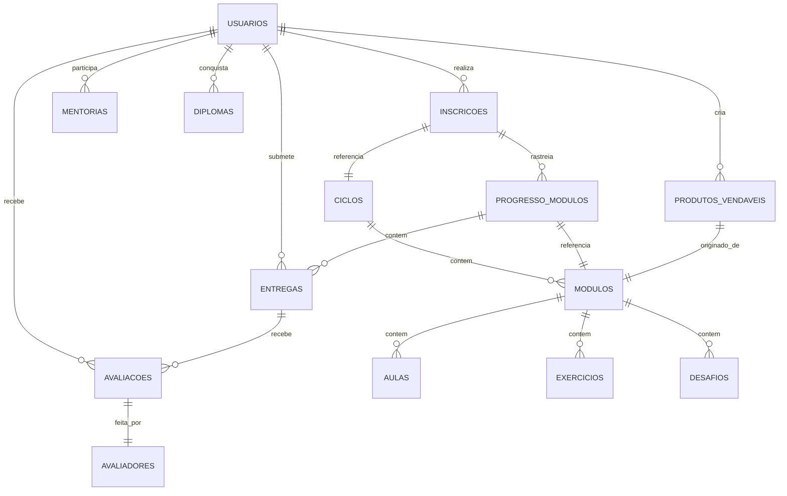

# 🗄️ Modelo de Dados — UNIVERSITAS

## 📋 Visão Geral

O banco de dados da UNIVERSITAS é projetado para:
- ✅ Registrar todo o histórico acadêmico do aluno
- ✅ Controlar progressão e desbloqueio de conteúdos
- ✅ Armazenar avaliações (IA + humanas + pares)
- ✅ Gerenciar produtos vendáveis criados
- ✅ Rastrear mentoria e ensino
- ✅ Emitir diplomas e certificados

---

## 🏗️ Arquitetura do Banco

**SGBD:** PostgreSQL 15+  
**Extensões Utilizadas:**
- `uuid-ossp` — Para geração de UUIDs
- `pg_trgm` — Para busca textual avançada
- `pgcrypto` — Para hashing e criptografia

---

## 📊 Diagrama Entidade-Relacionamento (Conceitual)



---

## 📐 Tabelas Principais

### 1. Tabela `usuarios`
Armazena informações dos alunos, mentores e administradores.

```sql
CREATE TABLE usuarios (
    id UUID PRIMARY KEY DEFAULT uuid_generate_v4(),
    nome_completo VARCHAR(255) NOT NULL,
    email VARCHAR(255) UNIQUE NOT NULL,
    senha_hash VARCHAR(255) NOT NULL,
    tipo_usuario VARCHAR(50) NOT NULL CHECK (tipo_usuario IN ('aluno', 'mentor', 'admin')),
    data_cadastro TIMESTAMP DEFAULT CURRENT_TIMESTAMP,
    data_ultimo_acesso TIMESTAMP,
    telefone VARCHAR(20),
    linkedin VARCHAR(255),
    github VARCHAR(255),
    portfolio_url VARCHAR(255),
    biografia TEXT,
    foto_perfil_url VARCHAR(500),
    ativo BOOLEAN DEFAULT TRUE,
    criado_em TIMESTAMP DEFAULT CURRENT_TIMESTAMP,
    atualizado_em TIMESTAMP DEFAULT CURRENT_TIMESTAMP
);

CREATE INDEX idx_usuarios_email ON usuarios(email);
CREATE INDEX idx_usuarios_tipo ON usuarios(tipo_usuario);
```

---

### 2. Tabela `ciclos`
Define os 5 ciclos de formação.

```sql
CREATE TABLE ciclos (
    id UUID PRIMARY KEY DEFAULT uuid_generate_v4(),
    numero_ciclo INTEGER UNIQUE NOT NULL CHECK (numero_ciclo BETWEEN 1 AND 5),
    nome VARCHAR(255) NOT NULL,
    descricao TEXT NOT NULL,
    perfil_entrada VARCHAR(100) NOT NULL,
    perfil_saida VARCHAR(100) NOT NULL,
    duracao_estimada_meses INTEGER,
    pontuacao_minima_aprovacao INTEGER DEFAULT 75,
    ordem_exibicao INTEGER NOT NULL,
    ativo BOOLEAN DEFAULT TRUE,
    criado_em TIMESTAMP DEFAULT CURRENT_TIMESTAMP,
    atualizado_em TIMESTAMP DEFAULT CURRENT_TIMESTAMP
);

-- Inserir os 5 ciclos
INSERT INTO ciclos (numero_ciclo, nome, descricao, perfil_entrada, perfil_saida, duracao_estimada_meses, ordem_exibicao) VALUES
(1, 'Fundamentos de Automação', 'Criar automações simples e vendê-las', 'Iniciante', 'Júnior', 6, 1),
(2, 'Integração Profissional', 'Integrar sistemas complexos e criar produtos recorrentes', 'Júnior', 'Pleno', 9, 2),
(3, 'Arquitetura de Automação', 'Projetar arquiteturas robustas e liderar projetos', 'Pleno', 'Sênior', 12, 3),
(4, 'Automação com IA', 'Integrar IA estrategicamente em automações', 'Sênior', 'Sênior+', 9, 4),
(5, 'Produtos, SaaS e Liderança', 'Criar SaaS, ensinar e liderar', 'Sênior+', 'Master', 12, 5);
```

---

### 3. Tabela `modulos`
Módulos dentro de cada ciclo.

```sql
CREATE TABLE modulos (
    id UUID PRIMARY KEY DEFAULT uuid_generate_v4(),
    ciclo_id UUID REFERENCES ciclos(id) ON DELETE CASCADE,
    codigo VARCHAR(50) UNIQUE NOT NULL, -- Ex: C1M01, C2M05
    nome VARCHAR(255) NOT NULL,
    descricao TEXT NOT NULL,
    objetivos TEXT[], -- Array de objetivos de aprendizagem
    ordem_no_ciclo INTEGER NOT NULL,
    pontuacao_maxima INTEGER DEFAULT 100,
    pontuacao_minima_aprovacao INTEGER DEFAULT 70,
    desbloqueado_por UUID REFERENCES modulos(id), -- Módulo anterior necessário
    pontuacao_minima_desbloqueio INTEGER DEFAULT 70,
    duracao_estimada_horas INTEGER,
    nivel_dificuldade VARCHAR(50) CHECK (nivel_dificuldade IN ('iniciante', 'intermediário', 'avançado', 'expert')),
    tags TEXT[], -- Ex: ['APIs', 'Webhooks', 'Vendas']
    ativo BOOLEAN DEFAULT TRUE,
    criado_em TIMESTAMP DEFAULT CURRENT_TIMESTAMP,
    atualizado_em TIMESTAMP DEFAULT CURRENT_TIMESTAMP
);

CREATE INDEX idx_modulos_ciclo ON modulos(ciclo_id);
CREATE INDEX idx_modulos_codigo ON modulos(codigo);
```

---

### 4. Tabela `aulas`
Aulas dentro de cada módulo.

```sql
CREATE TABLE aulas (
    id UUID PRIMARY KEY DEFAULT uuid_generate_v4(),
    modulo_id UUID REFERENCES modulos(id) ON DELETE CASCADE,
    ordem_na_aula INTEGER NOT NULL,
    titulo VARCHAR(255) NOT NULL,
    tipo_conteudo VARCHAR(50) CHECK (tipo_conteudo IN ('video', 'texto', 'pratica', 'simulacao', 'quiz')),
    conteudo_markdown TEXT, -- Conteúdo em Markdown
    video_url VARCHAR(500),
    duracao_minutos INTEGER,
    recursos_necessarios TEXT[], -- Ex: ['n8n local', 'conta Zapier', 'API key']
    criado_em TIMESTAMP DEFAULT CURRENT_TIMESTAMP,
    atualizado_em TIMESTAMP DEFAULT CURRENT_TIMESTAMP
);

CREATE INDEX idx_aulas_modulo ON aulas(modulo_id);
```

---

### 5. Tabela `exercicios`
Exercícios práticos guiados.

```sql
CREATE TABLE exercicios (
    id UUID PRIMARY KEY DEFAULT uuid_generate_v4(),
    modulo_id UUID REFERENCES modulos(id) ON DELETE CASCADE,
    ordem_no_modulo INTEGER NOT NULL,
    titulo VARCHAR(255) NOT NULL,
    descricao TEXT NOT NULL,
    instrucoes_markdown TEXT NOT NULL,
    criterios_avaliacao JSONB, -- JSON com critérios
    pontuacao_maxima INTEGER DEFAULT 30,
    tempo_estimado_minutos INTEGER,
    recursos_fornecidos TEXT[], -- Links, templates, APIs de teste
    criado_em TIMESTAMP DEFAULT CURRENT_TIMESTAMP,
    atualizado_em TIMESTAMP DEFAULT CURRENT_TIMESTAMP
);

CREATE INDEX idx_exercicios_modulo ON exercicios(modulo_id);
```

---

### 6. Tabela `desafios`
Desafios avaliativos (produtos vendáveis).

```sql
CREATE TABLE desafios (
    id UUID PRIMARY KEY DEFAULT uuid_generate_v4(),
    modulo_id UUID REFERENCES modulos(id) ON DELETE CASCADE,
    titulo VARCHAR(255) NOT NULL,
    descricao_problema TEXT NOT NULL,
    cenario_real TEXT NOT NULL, -- História do cliente fictício
    requisitos_minimos TEXT[] NOT NULL,
    requisitos_bonus TEXT[],
    criterios_avaliacao JSONB NOT NULL,
    pontuacao_maxima INTEGER DEFAULT 40,
    produto_esperado VARCHAR(255) NOT NULL, -- Ex: "Automação de captura de leads"
    valor_mercado_estimado VARCHAR(100), -- Ex: "R$ 500 - R$ 1.500/mês"
    tempo_estimado_horas INTEGER,
    criado_em TIMESTAMP DEFAULT CURRENT_TIMESTAMP,
    atualizado_em TIMESTAMP DEFAULT CURRENT_TIMESTAMP
);

CREATE INDEX idx_desafios_modulo ON desafios(modulo_id);
```

---

### 7. Tabela `inscricoes`
Inscrição do aluno em um ciclo.

```sql
CREATE TABLE inscricoes (
    id UUID PRIMARY KEY DEFAULT uuid_generate_v4(),
    usuario_id UUID REFERENCES usuarios(id) ON DELETE CASCADE,
    ciclo_id UUID REFERENCES ciclos(id) ON DELETE CASCADE,
    data_inscricao TIMESTAMP DEFAULT CURRENT_TIMESTAMP,
    data_inicio TIMESTAMP,
    data_conclusao TIMESTAMP,
    status VARCHAR(50) DEFAULT 'em_andamento' CHECK (status IN ('em_andamento', 'concluido', 'pausado', 'cancelado')),
    pontuacao_media DECIMAL(5,2),
    progresso_percentual INTEGER DEFAULT 0 CHECK (progresso_percentual BETWEEN 0 AND 100),
    criado_em TIMESTAMP DEFAULT CURRENT_TIMESTAMP,
    atualizado_em TIMESTAMP DEFAULT CURRENT_TIMESTAMP,
    UNIQUE(usuario_id, ciclo_id)
);

CREATE INDEX idx_inscricoes_usuario ON inscricoes(usuario_id);
CREATE INDEX idx_inscricoes_ciclo ON inscricoes(ciclo_id);
```

---

### 8. Tabela `progresso_modulos`
Progresso do aluno em cada módulo.

```sql
CREATE TABLE progresso_modulos (
    id UUID PRIMARY KEY DEFAULT uuid_generate_v4(),
    inscricao_id UUID REFERENCES inscricoes(id) ON DELETE CASCADE,
    modulo_id UUID REFERENCES modulos(id) ON DELETE CASCADE,
    status VARCHAR(50) DEFAULT 'bloqueado' CHECK (status IN ('bloqueado', 'desbloqueado', 'em_andamento', 'concluido')),
    data_desbloqueio TIMESTAMP,
    data_inicio TIMESTAMP,
    data_conclusao TIMESTAMP,
    pontuacao_final DECIMAL(5,2),
    tentativas INTEGER DEFAULT 0,
    tempo_gasto_minutos INTEGER DEFAULT 0,
    criado_em TIMESTAMP DEFAULT CURRENT_TIMESTAMP,
    atualizado_em TIMESTAMP DEFAULT CURRENT_TIMESTAMP,
    UNIQUE(inscricao_id, modulo_id)
);

CREATE INDEX idx_progresso_modulos_inscricao ON progresso_modulos(inscricao_id);
CREATE INDEX idx_progresso_modulos_modulo ON progresso_modulos(modulo_id);
```

---

### 9. Tabela `entregas`
Entregas de exercícios e desafios pelos alunos.

```sql
CREATE TABLE entregas (
    id UUID PRIMARY KEY DEFAULT uuid_generate_v4(),
    progresso_modulo_id UUID REFERENCES progresso_modulos(id) ON DELETE CASCADE,
    tipo_entrega VARCHAR(50) NOT NULL CHECK (tipo_entrega IN ('exercicio', 'desafio', 'tcc')),
    exercicio_id UUID REFERENCES exercicios(id),
    desafio_id UUID REFERENCES desafios(id),
    data_entrega TIMESTAMP DEFAULT CURRENT_TIMESTAMP,
    url_repositorio VARCHAR(500),
    url_demonstracao VARCHAR(500),
    url_video_apresentacao VARCHAR(500),
    descricao_solucao TEXT,
    documentacao_markdown TEXT,
    arquivos_anexos JSONB, -- Array de URLs
    status_avaliacao VARCHAR(50) DEFAULT 'aguardando' CHECK (status_avaliacao IN ('aguardando', 'em_avaliacao', 'avaliado', 'requer_correcao')),
    pontuacao_total DECIMAL(5,2),
    feedback_geral TEXT,
    criado_em TIMESTAMP DEFAULT CURRENT_TIMESTAMP,
    atualizado_em TIMESTAMP DEFAULT CURRENT_TIMESTAMP
);

CREATE INDEX idx_entregas_progresso ON entregas(progresso_modulo_id);
CREATE INDEX idx_entregas_status ON entregas(status_avaliacao);
```

---

### 10. Tabela `avaliacoes`
Avaliações de entregas (por IA, mentores ou pares).

```sql
CREATE TABLE avaliacoes (
    id UUID PRIMARY KEY DEFAULT uuid_generate_v4(),
    entrega_id UUID REFERENCES entregas(id) ON DELETE CASCADE,
    avaliador_id UUID REFERENCES usuarios(id), -- NULL se for IA
    tipo_avaliador VARCHAR(50) NOT NULL CHECK (tipo_avaliador IN ('ia', 'mentor', 'par')),
    data_avaliacao TIMESTAMP DEFAULT CURRENT_TIMESTAMP,
    pontuacao_atribuida DECIMAL(5,2) NOT NULL,
    criterios_avaliados JSONB NOT NULL, -- Ex: {"qualidade_codigo": 8.5, "arquitetura": 9.0}
    feedback_detalhado TEXT,
    sugestoes_melhoria TEXT[],
    pontos_fortes TEXT[],
    pontos_fracos TEXT[],
    aprovado BOOLEAN,
    criado_em TIMESTAMP DEFAULT CURRENT_TIMESTAMP
);

CREATE INDEX idx_avaliacoes_entrega ON avaliacoes(entrega_id);
CREATE INDEX idx_avaliacoes_avaliador ON avaliacoes(avaliador_id);
```

---

### 11. Tabela `produtos_vendaveis`
Catálogo de produtos criados pelos alunos.

```sql
CREATE TABLE produtos_vendaveis (
    id UUID PRIMARY KEY DEFAULT uuid_generate_v4(),
    usuario_id UUID REFERENCES usuarios(id) ON DELETE CASCADE,
    modulo_id UUID REFERENCES modulos(id),
    entrega_id UUID REFERENCES entregas(id),
    nome_produto VARCHAR(255) NOT NULL,
    descricao TEXT NOT NULL,
    categoria VARCHAR(100), -- Ex: "Integração", "Automação de Marketing"
    nicho_mercado VARCHAR(255), -- Ex: "Agências de Marketing", "E-commerces"
    valor_sugerido_min DECIMAL(10,2),
    valor_sugerido_max DECIMAL(10,2),
    modelo_cobranca VARCHAR(50), -- Ex: "recorrente", "one-time", "por_uso"
    url_repositorio VARCHAR(500),
    url_demonstracao VARCHAR(500),
    documentacao_venda TEXT, -- Pitch de venda pronto
    roi_estimado TEXT, -- Retorno sobre investimento para o cliente
    tempo_implantacao_horas INTEGER,
    nivel_tecnico_cliente VARCHAR(50) CHECK (nivel_tecnico_cliente IN ('leigo', 'básico', 'intermediário', 'avançado')),
    publicado BOOLEAN DEFAULT FALSE,
    destaque BOOLEAN DEFAULT FALSE,
    visualizacoes INTEGER DEFAULT 0,
    criado_em TIMESTAMP DEFAULT CURRENT_TIMESTAMP,
    atualizado_em TIMESTAMP DEFAULT CURRENT_TIMESTAMP
);

CREATE INDEX idx_produtos_usuario ON produtos_vendaveis(usuario_id);
CREATE INDEX idx_produtos_categoria ON produtos_vendaveis(categoria);
CREATE INDEX idx_produtos_publicado ON produtos_vendaveis(publicado);
```

---

### 12. Tabela `mentorias`
Sessões de mentoria entre alunos e mentores.

```sql
CREATE TABLE mentorias (
    id UUID PRIMARY KEY DEFAULT uuid_generate_v4(),
    aluno_id UUID REFERENCES usuarios(id) ON DELETE CASCADE,
    mentor_id UUID REFERENCES usuarios(id) ON DELETE CASCADE,
    data_agendamento TIMESTAMP NOT NULL,
    duracao_minutos INTEGER DEFAULT 60,
    tipo_mentoria VARCHAR(50) CHECK (tipo_mentoria IN ('tecnica', 'carreira', 'negocios', 'arquitetura')),
    topico TEXT,
    status VARCHAR(50) DEFAULT 'agendada' CHECK (status IN ('agendada', 'realizada', 'cancelada', 'remarcada')),
    notas_mentor TEXT,
    notas_aluno TEXT,
   avaliacao_aluno INTEGER CHECK (avaliacao_aluno BETWEEN 1 AND 5),
    proximos_passos TEXT[],
    criado_em TIMESTAMP DEFAULT CURRENT_TIMESTAMP,
    atualizado_em TIMESTAMP DEFAULT CURRENT_TIMESTAMP
);

CREATE INDEX idx_mentorias_aluno ON mentorias(aluno_id);
CREATE INDEX idx_mentorias_mentor ON mentorias(mentor_id);
```

---

### 13. Tabela `diplomas`
Diplomas conquistados pelos alunos.

```sql
CREATE TABLE diplomas (
    id UUID PRIMARY KEY DEFAULT uuid_generate_v4(),
    usuario_id UUID REFERENCES usuarios(id) ON DELETE CASCADE,
    ciclo_id UUID REFERENCES ciclos(id) ON DELETE CASCADE,
    tipo_diploma VARCHAR(100) NOT NULL,
    data_emissao TIMESTAMP DEFAULT CURRENT_TIMESTAMP,
    codigo_verificacao VARCHAR(100) UNIQUE NOT NULL,
    pontuacao_media_ciclo DECIMAL(5,2) NOT NULL,
    projetos_entregues INTEGER NOT NULL,
    horas_totais INTEGER,
    tcc_aprovado BOOLEAN DEFAULT FALSE,
    observacoes TEXT,
    url_certificado VARCHAR(500),
    ativo BOOLEAN DEFAULT TRUE,
    criado_em TIMESTAMP DEFAULT CURRENT_TIMESTAMP
);

CREATE INDEX idx_diplomas_usuario ON diplomas(usuario_id);
CREATE INDEX idx_diplomas_codigo ON diplomas(codigo_verificacao);
```

---

### 14. Tabela `tcc_projetos_finais`
Trabalhos de Conclusão de Curso.

```sql
CREATE TABLE tcc_projetos_finais (
    id UUID PRIMARY KEY DEFAULT uuid_generate_v4(),
    usuario_id UUID REFERENCES usuarios(id) ON DELETE CASCADE,
    ciclo_id UUID REFERENCES ciclos(id) ON DELETE CASCADE,
    titulo VARCHAR(255) NOT NULL,
    resumo TEXT NOT NULL,
    problema_resolvido TEXT NOT NULL,
    solucao_proposta TEXT NOT NULL,
    tecnologias_utilizadas TEXT[],
    url_repositorio VARCHAR(500),
    url_demonstracao_video VARCHAR(500),
    url_aplicacao_live VARCHAR(500),
    documentacao_completa TEXT,
    modelo_negocio TEXT,
    estrategia_venda TEXT,
    aula_explicativa_url VARCHAR(500),
    data_submissao TIMESTAMP,
    data_defesa TIMESTAMP,
    status VARCHAR(50) DEFAULT 'em_desenvolvimento' CHECK (status IN ('em_desenvolvimento', 'submetido', 'em_avaliacao', 'aprovado', 'reprovado')),
    pontuacao_final DECIMAL(5,2),
    feedback_banca TEXT,
    orientador_id UUID REFERENCES usuarios(id),
    criado_em TIMESTAMP DEFAULT CURRENT_TIMESTAMP,
    atualizado_em TIMESTAMP DEFAULT CURRENT_TIMESTAMP
);

CREATE INDEX idx_tcc_usuario ON tcc_projetos_finais(usuario_id);
CREATE INDEX idx_tcc_status ON tcc_projetos_finais(status);
```

---

### 15. Tabela `interacoes_ia`
Log de interações dos alunos com a IA.

```sql
CREATE TABLE interacoes_ia (
    id UUID PRIMARY KEY DEFAULT uuid_generate_v4(),
    usuario_id UUID REFERENCES usuarios(id) ON DELETE CASCADE,
    modulo_id UUID REFERENCES modulos(id),
    tipo_interacao VARCHAR(50) CHECK (tipo_interacao IN ('duvida', 'revisao_codigo', 'feedback', 'simulacao_venda', 'avaliacao')),
    modo_ia VARCHAR(50) CHECK (modo_ia IN ('aluno', 'mentor', 'professor')),
    mensagem_usuario TEXT,
    resposta_ia TEXT,
    tokens_utilizados INTEGER,
    tempo_resposta_ms INTEGER,
    util BOOLEAN, -- Feedback do aluno sobre a resposta
    data_interacao TIMESTAMP DEFAULT CURRENT_TIMESTAMP
);

CREATE INDEX idx_interacoes_usuario ON interacoes_ia(usuario_id);
CREATE INDEX idx_interacoes_data ON interacoes_ia(data_interacao);
```

---

## 🔐 Segurança e Permissões

### Roles do Banco de Dados

```sql
-- Role para alunos (apenas leitura de conteúdo, escrita em entregas)
CREATE ROLE aluno_role;
GRANT SELECT ON ciclos, modulos, aulas, exercicios, desafios TO aluno_role;
GRANT SELECT, INSERT, UPDATE ON entregas, produtos_vendaveis TO aluno_role;

-- Role para mentores (leitura + avaliação)
CREATE ROLE mentor_role;
GRANT SELECT ON ALL TABLES IN SCHEMA public TO mentor_role;
GRANT INSERT, UPDATE ON avaliacoes, mentorias TO mentor_role;

-- Role para admins (tudo)
CREATE ROLE admin_role;
GRANT ALL PRIVILEGES ON ALL TABLES IN SCHEMA public TO admin_role;
```

---

## 📈 Views Úteis

### View: Progresso Geral do Aluno

```sql
CREATE VIEW vw_progresso_aluno AS
SELECT 
    u.id AS usuario_id,
    u.nome_completo,
    c.nome AS ciclo_nome,
    i.status AS status_inscricao,
    i.progresso_percentual,
    i.pontuacao_media,
    COUNT(pm.id) AS total_modulos,
    SUM(CASE WHEN pm.status = 'concluido' THEN 1 ELSE 0 END) AS modulos_concluidos,
    SUM(pm.tempo_gasto_minutos) AS tempo_total_minutos
FROM usuarios u
JOIN inscricoes i ON u.id = i.usuario_id
JOIN ciclos c ON i.ciclo_id = c.id
LEFT JOIN progresso_modulos pm ON i.id = pm.inscricao_id
GROUP BY u.id, u.nome_completo, c.nome, i.status, i.progresso_percentual, i.pontuacao_media;
```

### View: Ranking de Excelência

```sql
CREATE VIEW vw_ranking_excelencia AS
SELECT 
    u.nome_completo,
    c.nome AS ciclo,
    AVG(pm.pontuacao_final) AS pontuacao_media,
    COUNT(e.id) AS total_entregas,
    SUM(CASE WHEN a.aprovado = TRUE THEN 1 ELSE 0 END) AS entregas_aprovadas,
    ROW_NUMBER() OVER (PARTITION BY c.id ORDER BY AVG(pm.pontuacao_final) DESC) AS ranking_no_ciclo
FROM usuarios u
JOIN inscricoes i ON u.id = i.usuario_id
JOIN ciclos c ON i.ciclo_id = c.id
JOIN progresso_modulos pm ON i.id = pm.inscricao_id
LEFT JOIN entregas e ON pm.id = e.progresso_modulo_id
LEFT JOIN avaliacoes a ON e.id = a.entrega_id
WHERE pm.status = 'concluido'
GROUP BY u.id, u.nome_completo, c.id, c.nome;
```

---

## 🚀 Triggers e Automações

### Trigger: Atualizar Progresso do Ciclo

```sql
CREATE OR REPLACE FUNCTION atualizar_progresso_ciclo()
RETURNS TRIGGER AS $$
BEGIN
    UPDATE inscricoes i
    SET 
        progresso_percentual = (
            SELECT (COUNT(CASE WHEN pm.status = 'concluido' THEN 1 END)::DECIMAL / COUNT(*)::DECIMAL * 100)::INTEGER
            FROM progresso_modulos pm
            WHERE pm.inscricao_id = NEW.inscricao_id
        ),
        pontuacao_media = (
            SELECT AVG(pm.pontuacao_final)
            FROM progresso_modulos pm
            WHERE pm.inscricao_id = NEW.inscricao_id AND pm.status = 'concluido'
        ),
        atualizado_em = CURRENT_TIMESTAMP
    WHERE i.id = NEW.inscricao_id;
    
    RETURN NEW;
END;
$$ LANGUAGE plpgsql;

CREATE TRIGGER trigger_atualizar_progresso
AFTER INSERT OR UPDATE ON progresso_modulos
FOR EACH ROW
EXECUTE FUNCTION atualizar_progresso_ciclo();
```

### Trigger: Desbloquear Próximo Módulo

```sql
CREATE OR REPLACE FUNCTION desbloquear_proximo_modulo()
RETURNS TRIGGER AS $$
DECLARE
    proximo_modulo_id UUID;
    pontuacao_necessaria INTEGER;
BEGIN
    -- Verificar se o módulo foi concluído com sucesso
    IF NEW.status = 'concluido' AND NEW.pontuacao_final >= 70 THEN
        -- Buscar módulo que depende deste
        SELECT m.id, m.pontuacao_minima_desbloqueio
        INTO proximo_modulo_id, pontuacao_necessaria
        FROM modulos m
        WHERE m.desbloqueado_por = (
            SELECT modulo_id FROM progresso_modulos WHERE id = NEW.id
        )
        AND NEW.pontuacao_final >= m.pontuacao_minima_desbloqueio
        LIMIT 1;
        
        -- Se encontrou, desbloquear
        IF proximo_modulo_id IS NOT NULL THEN
            INSERT INTO progresso_modulos (inscricao_id, modulo_id, status, data_desbloqueio)
            VALUES (NEW.inscricao_id, proximo_modulo_id, 'desbloqueado', CURRENT_TIMESTAMP)
            ON CONFLICT (inscricao_id, modulo_id) DO UPDATE
            SET status = 'desbloqueado', data_desbloqueio = CURRENT_TIMESTAMP;
        END IF;
    END IF;
    
    RETURN NEW;
END;
$$ LANGUAGE plpgsql;

CREATE TRIGGER trigger_desbloquear_modulo
AFTER UPDATE ON progresso_modulos
FOR EACH ROW
WHEN (NEW.status = 'concluido')
EXECUTE FUNCTION desbloquear_proximo_modulo();
```

---

## 📊 Relatórios e Analytics

### Consulta: Taxa de Aprovação por Módulo

```sql
SELECT 
    m.codigo,
    m.nome,
    COUNT(DISTINCT pm.id) AS total_alunos,
    COUNT(DISTINCT CASE WHEN pm.status = 'concluido' AND pm.pontuacao_final >= 70 THEN pm.id END) AS alunos_aprovados,
    (COUNT(DISTINCT CASE WHEN pm.status = 'concluido' AND pm.pontuacao_final >= 70 THEN pm.id END)::DECIMAL / 
     NULLIF(COUNT(DISTINCT pm.id), 0) * 100)::DECIMAL(5,2) AS taxa_aprovacao_pct,
    AVG(pm.pontuacao_final) AS pontuacao_media,
    AVG(pm.tempo_gasto_minutos) AS tempo_medio_minutos
FROM modulos m
LEFT JOIN progresso_modulos pm ON m.id = pm.modulo_id
WHERE pm.status != 'bloqueado'
GROUP BY m.id, m.codigo, m.nome
ORDER BY m.codigo;
```

---

**© 2026 UNIVERSITAS — Modelo de Dados v1.0**
